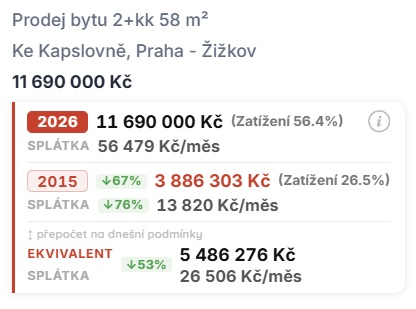

# Srealitky Universes -> Unreal Estate 

A Chrome extension that adds affordability context to every property listing on [sreality.cz](https://www.sreality.cz/).

---

## What it shows

You're looking at a flat in Prague for **8 500 000 Kč**. The extension adds this widget next to the price:

**What these numbers mean:**

- **2026 row** — today's asking price. A couple earning average Prague wages would spend 58% of their take-home pay on the mortgage. That's the reality.
- **2015 row** — what the same flat would have cost in 2015, estimated using ČSÚ price indices. Back then, the same couple spent 27% of their income.
- **Equiv row** — what the flat would need to cost *today* for the burden to feel like 2015. In this case: **3 900 000 Kč** instead of 8 500 000 Kč.

The comparison year is adjustable (2000–2025). Default is 2015.

---

## How it works

The extension compares mortgage burden — the share of household income eaten by a monthly mortgage payment — across time. It accounts for today's higher wages, today's interest rates, and regional price growth. The result is a single honest number: *what should this actually cost?*

Click the **ⓘ** icon on any widget for a full plain-language explanation of the math for that specific listing.

---

## How to install

1. **Download** the latest `.zip` from [Releases](https://github.com/Omni-Wild/Unreal-Estate/releases/latest)
2. **Unzip** the file into a folder on your computer
3. Open Chrome and go to `chrome://extensions`
4. Turn on **Developer mode** (toggle in the top-right corner)
5. Click **Load unpacked** and select the unzipped folder
6. Visit [sreality.cz](https://www.sreality.cz/) — the extension activates automatically

---

## Data sources

All data is static and bundled inside the extension. No network requests are made.

| | Source |
|---|---|
| Mortgage rates | Fincentrum/Swiss Life Hypoindex + ČNB |
| Property prices | ČSÚ realized transaction price indices |
| Wages | ČSÚ annual statistics, regional breakdowns March 2026 |

14 Czech regions are tracked separately — Praha, Jihomoravský kraj, Moravskoslezský kraj, and so on — because wages and price growth differ significantly across the country.

---

## For developers

Built with TypeScript + Vite, Manifest V3. See [`docs/architecture-diagram.html`](docs/architecture-diagram.html) for a full architecture overview.

---

*Not affiliated with Sreality.cz or Seznam.cz. Independent third-party project.*
